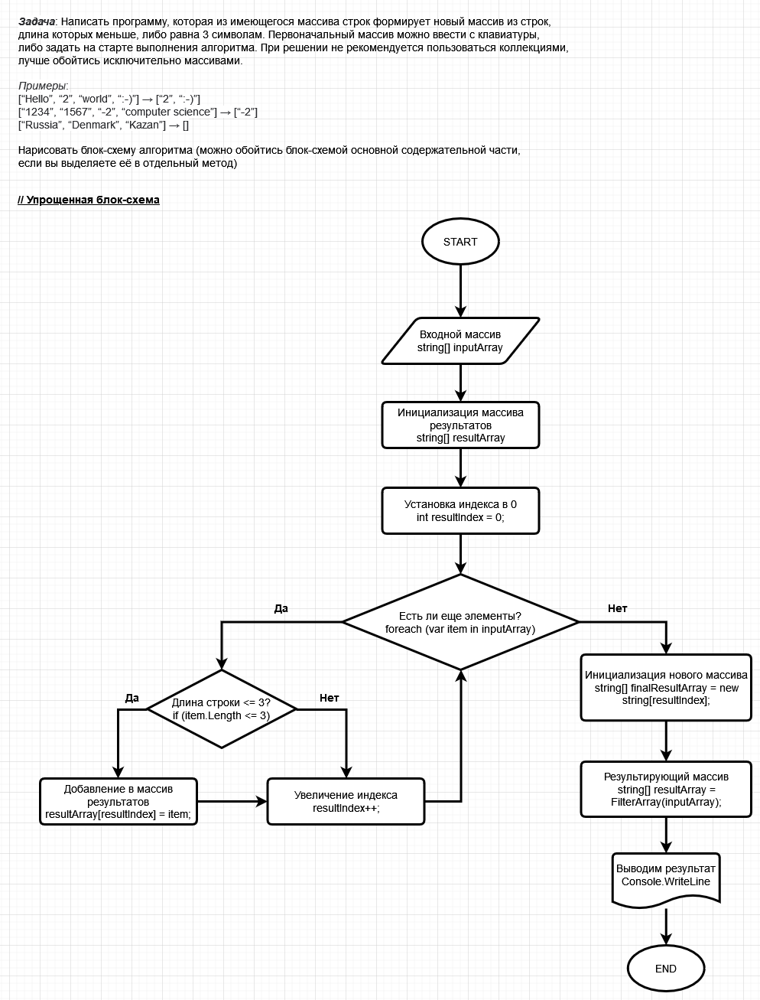

# Итоговая контрольная работа по основному блоку. &#128218;

## Задача:  	&#129488;

&nbsp;&nbsp;&nbsp;&nbsp;**СДАВАТЬ ССЫЛКОЙ НА GITHUB** 

&nbsp;&nbsp;&nbsp;&nbsp;Данная работа необходима для проверки ваших знаний и навыков по итогу прохождения первого блока обучения на программе Разработчик. Мы должны убедится, что базовое знакомство с IT прошло успешно.

&nbsp;&nbsp;&nbsp;&nbsp;Задача алгоритмически не самая сложная, однако для полноценного выполнения проверочной работы *необходимо*:

1. Создать репозиторий на GitHub
2. Нарисовать блок-схему алгоритма (можно обойтись блок-схемой основной содержательной части, если вы выделяете её в отдельный метод)
3. Снабдить репозиторий оформленным текстовым описанием решения (файл README.md)
4. Написать программу, решающую поставленную задачу
5. Использовать контроль версий в работе над этим небольшим проектом (не должно быть так, что всё залито одним коммитом, как минимум этапы 2, 3, и 4 должны быть расположены в разных коммитах).


>**Задача:** Написать программу, которая из имеющегося массива строк формирует новый массив из строк, длина которых меньше, либо равна 3 символам. Первоначальный массив можно ввести с клавиатуры, либо задать на старте выполнения алгоритма. При решении не рекомендуется пользоваться *коллекциями*, лучше обойтись исключительно *массивами*.
**Примеры:**
[“Hello”, “2”, “world”, “:-)”] → [“2”, “:-)”]
[“1234”, “1567”, “-2”, “computer science”] → [“-2”]
[“Russia”, “Denmark”, “Kazan”] → [] 


## Текстовое описание решения &#129299;

&nbsp;&nbsp;&nbsp;&nbsp;В этом решении я использую только два массива: исходный массив строк и массив для хранения отфильтрованных строк. Это *минимизирует использование памяти*, так как не создаются дополнительные объекты или коллекции для временного хранения данных.

&nbsp;&nbsp;&nbsp;&nbsp;Обход массива строк выполняется один раз в цикле, при этом каждая строка проверяется на соответствие условию (длина <= 3 символам).


## Подробное описание решения задачи &#129497;

```C#
using System;
```

&nbsp;&nbsp;&nbsp;&nbsp;Директива *using* сообщает компилятору о том, что код будет использовать функционал из пространства имен *System*, которое содержит базовые классы *.NET Framework*


```C#
class Program
{
    static void Main()
    {
        Console.WriteLine("Введите элементы массива через пробел:");
        string[] inputArray = Console.ReadLine().Split(' ');
```

&nbsp;&nbsp;&nbsp;&nbsp;Объявление класса Program, в котором определен статический метод Main, который является точкой входа в программу. Программа начинает выполнение с этой точки. В этом методе выводится приглашение к вводу пользователю, после чего считывается введенная строка с помощью *Console.ReadLine()*, разбивается на отдельные элементы массива с помощью *Split(' ')* (разделитель - пробел), и результат сохраняется в массиве *inputArray*.


```C#
string[] resultArray = FilterArray(inputArray);
```

&nbsp;&nbsp;&nbsp;&nbsp;Эта строка вызывает метод *FilterArray*, передавая ему inputArray в качестве аргумента, и сохраняет его результат в массиве resultArray.

```C#
Console.WriteLine("Новый массив: " + string.Join(", ", resultArray));
```

&nbsp;&nbsp;&nbsp;&nbsp;Здесь выводится результат в одну строку через запятую с помощью метода *string.Join*, который объединяет элементы массива в одну строку, разделяя их запятой.

```C#
    }
    static string[] FilterArray(string[] inputArray)
    {
        string[] resultArray = new string[inputArray.Length];
        int resultIndex = 0;
```

&nbsp;&nbsp;&nbsp;&nbsp;Метод *FilterArray* принимает массив строк в качестве входного аргумента. Он создает массив *resultArray* для хранения строк, которые удовлетворяют условию (длина <= 3 символов), и переменную *resultIndex* для отслеживания текущего индекса в массиве *resultArray*.


```C#
        foreach (var item in inputArray)
        {
            if (item.Length <= 3)
            {
                resultArray[resultIndex] = item;
                resultIndex++;
            }
        }
```


&nbsp;&nbsp;&nbsp;&nbsp;Здесь происходит фильтрация входного массива *inputArray*. Каждый элемент проверяется на длину, и если он меньше или равен 3 символам, то он добавляется в *resultArray*, а затем *resultIndex* увеличивается.


```C#
string[] finalResultArray = new string[resultIndex];
Array.Copy(resultArray, finalResultArray, resultIndex);
```


&nbsp;&nbsp;&nbsp;&nbsp;Создается новый массив *finalResultArray* с учетом количества строк, которые удовлетворяют условию (длина <= 3 символов), используя *resultIndex* для определения размера массива. Затем метод *Array.Copy* копирует соответствующие элементы из *resultArray* в *finalResultArray*.


```C#
return finalResultArray;
```

&nbsp;&nbsp;&nbsp;&nbsp;Метод *FilterArray* завершается возвратом отфильтрованного массива *finalResultArray*.


### Упрощённая блок-схема алгоритма: 


